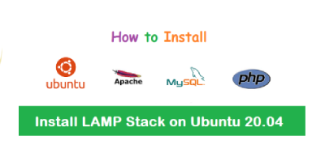

<p align="center"><a href="https://github.com/tuhinsorker/ubuntu-commandline" target="_blank"></a></p>

These instructions should help you set up a LAMP stack with corrected and enhanced steps for installing and configuring Apache, MySQL, PHP, and phpMyAdmin on Ubuntu 20.04 and upper version.

## Install Apache

1. Update the package list:

```bash
sudo apt update
```

2. Install Apache:

```bash
sudo apt install apache2
```

## Configure Firewall

1. Allow OpenSSH for secure remote access:

```bash
sudo ufw allow OpenSSH
```

2. Allow Apache Full, which includes both HTTP (80) and HTTPS (443) ports:

```bash
sudo ufw allow in "Apache Full"
```

3. Enable the firewall:

```bash
sudo ufw enable
```

4. Verify the firewall settings:

```bash
sudo ufw status
```

## Test Apache

Check the status of the Apache service:

```bash
sudo systemctl status apache2
```

## Install MySQL

1. Update the package list:

```bash
sudo apt update
```

2. Install MySQL Server:

```bash
sudo apt install mysql-server
```

3. Check the status of the MySQL service:

```bash
sudo systemctl status mysql
```

## Create MySQL User

1. Access the MySQL shell:

```bash
sudo mysql
```

2. Create a new MySQL user and grant privileges (replace 'newuser' and 'password' with your desired username and password):

```sql
CREATE USER 'newuser'@'localhost' IDENTIFIED BY 'password';
GRANT ALL PRIVILEGES ON *.* TO 'newuser'@'localhost';
FLUSH PRIVILEGES;
```

## Change MySQL Root Password (Optional)

If you want to change the root password for MySQL:

```bash
ALTER USER 'root'@'localhost' IDENTIFIED WITH 'mysql_native_password' BY 'newpassword';
```

## Add a PPA Repository

1. Run the following command:
```bash
sudo apt install software-properties-common
```
2. Run the following command:
```bash
sudo add-apt-repository ppa:ondrej/php
```
3. After adding the repository, update your package list:
```bash
sudo apt update
```


## Install PHP Version 7.4

1. To install PHP 7.4 FPM, you’d run:
```bash
sudo apt install php7.4-fpm
```
OR if you don’t want to install PHP-FMP version then follow this command:
```bash
sudo apt install php7.4
```
## Install PHP 7.4 Extensions
1. Run the following command:
```bash
sudo apt install phpX.Y-[extension name]
```
3. Commonly, the most useful extensions you need include common, curl, mbstring, opcache, readline, xml, zip, mysql, gd,libapache2 . You can install all these extensions using the following command:
```bash
sudo apt install php7.4-cli libapache2-mod-php7.4 php7.4-common php7.4-curl php7.4-mbstring php7.4-opcache php7.4-readline php7.4-xml php7.4-zip php7.4-mysql php7.4-gd
```

## Install PHP 8.0

1. Update all system packages to the latest, Run the following command:
```bash
sudo apt-get update
sudo apt-get install php8.0
```
2. To install PHP 8 extensions on Ubuntu 20.04, Run the following command:
```bash
sudo apt-get install php8.0-<extension>
```

Example:
```bash
sudo apt-get install php8.0-cli php8.0-common php8.0-imap php8.0-mysql php8.0-redis php8.0-snmp php8.0-xml php8.0-imagick php8.0-intl php8.0-fpm php8.0-imap
 sudo apt install libapache2-mod-php8.0
```

## Install PHP

1. Update the package list and install necessary software properties:

```bash
sudo apt update
sudo apt install -y software-properties-common
```

2. Add the PHP repository:

```bash
sudo add-apt-repository ppa:ondrej/php
sudo apt update
```

## Install PHP 8.1 and required modules:

```bash
sudo apt-get install -y php8.1 php8.1-cli php8.1-common php8.1-mysql php8.1-zip php8.1-gd php8.1-mbstring php8.1-curl php8.1-xml php8.1-bcmath libapache2-mod-php8.1 php8.1-json
```


## How to install PHP 8.2 on Ubuntu 22.04
```bash
apt-get update
sudo apt-get install php8.2
update-alternatives --set php /usr/bin/php8.2
```
## Verifying the PHP version
```bash
 php -v
```
## Install PHP 8.2 Extensions
```bash
sudo apt install php8.2 php8.2-cli php8.2-fpm php8.2-mysql php8.2-xml php8.2-mbstring php8.2-curl php8.2-zip php8.2-bcmath php8.2-gd php8.2-intl php8.2-soap php8.2-opcache php8.2-redis    
```


## Switching Between PHP Versions
1. To switch between PHP versions, you can use the update-alternatives command. For instance, to switch to PHP 7.4, run:
```bash
sudo update-alternatives --set php /usr/bin/php7.4
```
To confirm the active PHP version, you can use the php -v command:
```bash
php -v
```

2. Configuring Web Servers
If you’re running web applications, you’ll also need to configure your web server to use the desired PHP version. For Apache, you can enable PHP for a specific version with:
Disable your current PHP version and then enable PHP 7.4 for the Apache server.
Here are the corrected commands:

For example, if your current PHP version is PHP 7.4:
```bash
sudo a2dismod php8.1
```
And then enable PHP 7.4 for the Apache server:
```bash
sudo a2enmod php7.4
```

## Installing Latest phpMyAdmin

1. Download the latest version of phpMyAdmin:

```bash
wget https://www.phpmyadmin.net/downloads/phpMyAdmin-latest-all-languages.tar.gz
```

2. Extract the downloaded archive:

```bash
tar xvf phpMyAdmin-latest-all-languages.tar.gz
```

3. Move the resulting folder to `/usr/share/phpmyadmin`:

```bash
sudo mkdir /usr/share/phpmyadmin/
sudo mv phpMyAdmin-*/* /usr/share/phpmyadmin

```

4. Create a directory for phpMyAdmin temp files:

```bash
sudo mkdir -p /var/lib/phpmyadmin/tmp
sudo chown -R www-data:www-data /var/lib/phpmyadmin
```

5. Create a directory for phpMyAdmin configuration files:

```bash
sudo mkdir /etc/phpmyadmin/
```

6. Create a phpMyAdmin configuration file:

```bash
sudo cp /usr/share/phpmyadmin/config.sample.inc.php /usr/share/phpmyadmin/config.inc.php
```

7. Edit the configuration file:

```bash
sudo nano /usr/share/phpmyadmin/config.inc.php
```

Replace the `blowfish_secret` and add the `TempDir`:

```php
$cfg['blowfish_secret'] = 'H2OxcGXxflSd8JwrwVlh6KW6s2rER6HM';
$cfg['TempDir'] = '/var/lib/phpmyadmin/tmp';
```

8. Create a phpMyAdmin Apache configuration file:

```bash
sudo nano /etc/apache2/conf-enabled/phpmyadmin.conf
```

Paste the following content:

```bash
Alias /phpmyadmin /usr/share/phpmyadmin

<Directory /usr/share/phpmyadmin>
    Options SymLinksIfOwnerMatch
    DirectoryIndex index.php

    <IfModule mod_php5.c>
        <IfModule mod_mime.c>
            AddType application/x-httpd-php .php
        </IfModule>
        <FilesMatch ".+\.php$">
            SetHandler application/x-httpd-php
        </FilesMatch>

        php_value include_path .
        php_admin_value upload_tmp_dir /var/lib/phpmyadmin/tmp
        php_admin_value open_basedir /usr/share/phpmyadmin/:/etc/phpmyadmin/:/var/lib/phpmyadmin/:/usr/share/php/php-gettext/:/usr/share/php/php-php-gettext/:/usr/share/javascript/:/usr/share/php/tcpdf/:/usr/share/doc/phpmyadmin/:/usr/share/php/phpseclib/
        php_admin_value mbstring.func_overload 0
    </IfModule>
    <IfModule mod_php.c>
        <IfModule mod_mime.c>
            AddType application/x-httpd-php .php
        </IfModule>
        <FilesMatch ".+\.php$">
            SetHandler application/x-httpd-php
        </FilesMatch>

        php_value include_path .
        php_admin_value upload_tmp_dir /var/lib/phpmyadmin/tmp
        php_admin_value open_basedir /usr/share/phpmyadmin/:/etc/phpmyadmin/:/var/lib/phpmyadmin/:/usr/share/php/php-gettext/:/usr/share/php/php-php-gettext/:/usr/share/javascript/:/usr/share/php/tcpdf/:/usr/share/doc/phpmyadmin/:/usr/share/php/phpseclib/
        php_admin_value mbstring.func_overload 0
    </IfModule>

</Directory>

# Authorize for setup
<Directory /usr/share/phpmyadmin/setup>
    <IfModule mod_authz_core.c>
        <IfModule mod_authn_file.c>
            AuthType Basic
            AuthName "phpMyAdmin Setup"
            AuthUserFile /etc/phpmyadmin/htpasswd.setup
        </IfModule>
        Require valid-user
    </IfModule>
</Directory>

# Disallow web access to directories that don't need it
<Directory /usr/share/phpmyadmin/templates>
    Require all denied
</Directory>
<Directory /usr/share/phpmyadmin/libraries>
    Require all denied
</Directory>
<Directory /usr/share/phpmyadmin/setup/lib>
    Require all denied
</Directory>
```

9. Delete the downloaded .gz file:

```bash
sudo rm phpMyAdmin-latest-all-languages.tar.gz
```

10. Reload Apache to apply changes:

```bash
sudo service apache2 reload
```

11. Restart Apache:

```bash
sudo systemctl restart apache2
```

## Enable .htaccess

1. Enable the rewrite module:

```bash
sudo a2enmod rewrite
```

2. Restart Apache:

```bash
sudo systemctl restart apache2
```

3. Edit the default virtual host configuration file:

```bash
sudo nano /etc/apache2/sites-available/000-default.conf
```

Add the following lines within the `<VirtualHost>` section:

```apache
Alias /phpmyadmin /var/www/html/phpmyadmin
<Directory "/var/www/html/phpmyadmin">
    Order Allow,Deny
    Allow from all
</Directory>

<Directory /var/www/html>
    Options Indexes FollowSymLinks MultiViews
    AllowOverride All
    Require all granted
</Directory>
```

4. Restart Apache again:

```bash
sudo systemctl restart apache2
```

5. Move your project folder to the root directory:

```bash
sudo mv /var/www/html/projectfolder/* /var/www/html/
```
